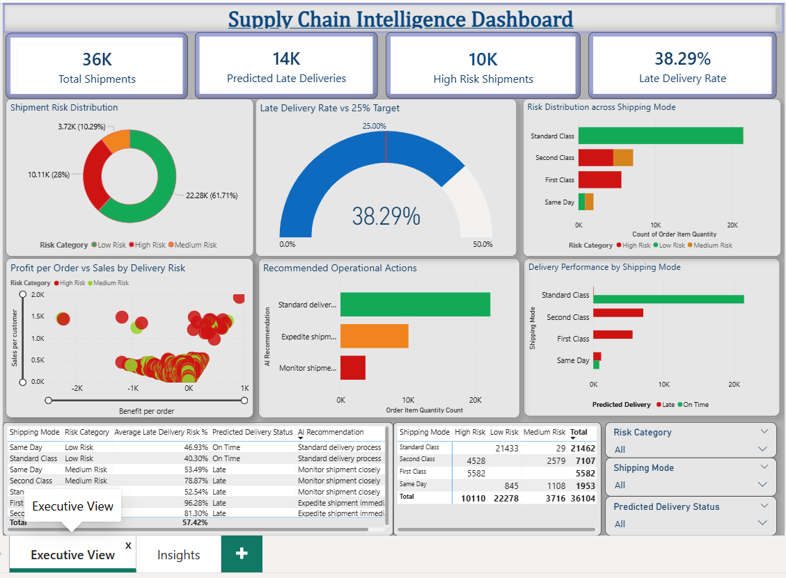
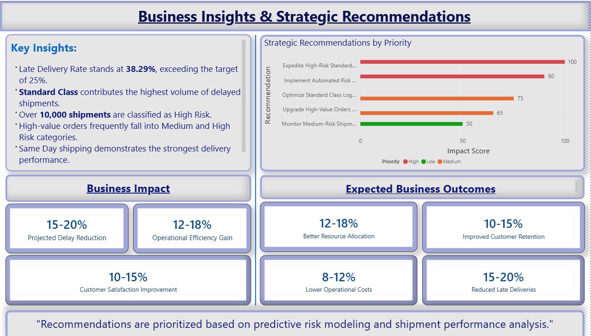

# shipment-risk-analysis-powerbi
Predictive shipment risk analysis using Machine Learning and Power BI.
# Shipment Risk Analysis & Late Delivery Prediction

## Executive Summary

Late deliveries remain one of the biggest operational challenges in supply chain management. This project leverages Machine Learning and Power BI to proactively identify at-risk shipments, predict delivery delays, and uncover the operational drivers behind shipment failures.

Using historical logistics data across 36,104 shipments, the solution classifies shipment risk into Low, Medium, and High categories while enabling business stakeholders to make faster, data-driven decisions.

The final outcome is a complete analytics solution combining predictive modeling, business intelligence, and strategic recommendations.

---

## Business Problem

Delayed shipments directly affect:

- Customer satisfaction
- Operational efficiency
- Transportation costs
- Brand reputation
- Customer retention

Traditional reactive approaches identify issues only after delays occur. This project shifts the process from reactive to predictive.

---

## Project Objectives

- Predict late deliveries before shipment dispatch
- Identify high-risk orders requiring immediate attention
- Analyze key drivers contributing to shipment delays
- Build an executive-level Power BI dashboard
- Recommend data-driven strategies to reduce delivery failures

---

## Dataset Overview

- Total Shipments: 36,104
- Features Analyzed: 50+
- Target Variable: Late Delivery Risk
- Industry Domain: Supply Chain & Logistics

### Risk Distribution

| Risk Category | Shipments | Percentage |
|--------------|----------:|-----------:|
| Low Risk     | 22,278    | 61.70%      |
| Medium Risk  | 3,716     | 10.29%      |
| High Risk    | 10,110    | 28.00%      |

---

## Technology Stack

- Python
- Pandas
- NumPy
- Matplotlib
- Seaborn
- Scikit-learn
- XGBoost
- Power BI

---

## Machine Learning Workflow

1. Data Cleaning and Validation
2. Exploratory Data Analysis
3. Feature Engineering
4. Model Training using XGBoost
5. Risk Classification
6. Prediction Generation
7. Business Intelligence Dashboard Development

---

## Key Performance Indicators

| Metric | Value |
|--------|------:|
| Total Shipments | 36,104 |
| Predicted Late Deliveries | 13,826 |
| Late Delivery Rate | 38.29% |
| High Risk Shipments | 10,110 |
| Medium Risk Shipments | 3,716 |
| Low Risk Shipments | 22,278 |

---

## Analytical Insights

### 1. Late Delivery Rate Exceeds Benchmark

The overall late delivery rate stands at 38.29%, significantly higher than the operational target of 25%.

This indicates substantial room for logistics optimization.

### 2. High-Risk Shipments Demand Immediate Attention

- 10,110 shipments are classified as High Risk.
- Nearly 1 in every 3 shipments requires proactive intervention.

### 3. Majority of Operations Remain Stable

- 61.7% of shipments fall into the Low Risk category.
- Existing logistics processes perform well for most deliveries.

### 4. Medium Risk Represents Hidden Opportunity

- 3,716 shipments can potentially be prevented from escalating into High Risk.
- This segment offers the highest improvement potential.

### 5. Standard Shipping Drives Most Delays

Standard Class contributes the largest share of delayed deliveries due to higher shipment volume and longer transit times.

---

## Business Recommendations

- Prioritize monitoring of High Risk shipments.
- Implement automated early-warning alerts.
- Optimize Standard Class delivery routes.
- Allocate premium logistics support to high-value orders.
- Closely monitor Medium Risk shipments before escalation.

---

## Expected Business Impact

| Outcome | Estimated Improvement |
|---------|----------------------:|
| Late Delivery Reduction | 15–20% |
| Operational Efficiency Gain | 12–18% |
| Cost Reduction | 8–12% |
| Customer Satisfaction Improvement | 10–15% |

---

## Power BI Dashboard Highlights

### Executive Overview

- Shipment KPIs
- Late Delivery Gauge
- Risk Distribution
- Shipping Mode Analysis
- Geographic Performance

### Insights & Strategy

- Key Business Insights
- Strategic Recommendations
- Business Impact Analysis
- Expected Outcomes

---

## Dashboard Preview

### Executive Overview


### Insights & Strategy


---

## Repository Structure

```text
Shipment-Risk-Analysis/
├── app/
├── dashboards/
├── data/
├── Images/
├── models/
├── notebooks/
├── reports/
├── requirements.txt
├── LICENSE
└── README.md

Project Files
Jupyter Notebook for end-to-end analysis
Processed dataset with risk predictions
Trained XGBoost model
Interactive Power BI dashboard
Business report and presentation assets
Future Enhancements
Real-time shipment monitoring
Streamlit web application deployment
Automated risk alerts
API integration with logistics systems
Continuous model retraining pipeline
Business Value Delivered

This project transforms raw shipment data into actionable intelligence by combining:

Predictive Analytics
Risk Classification
Executive Reporting
Strategic Decision Support

It enables logistics teams to reduce delays, improve service quality, and optimize operational efficiency.

Author

Gauri Borse
Aspiring Data Analyst | Power BI | Python | Machine Learning

LinkedIn: https://linkedin.com/in/your-profile
GitHub: https://github.com/your-username

Support

If you found this project valuable, please consider starring the repository.
